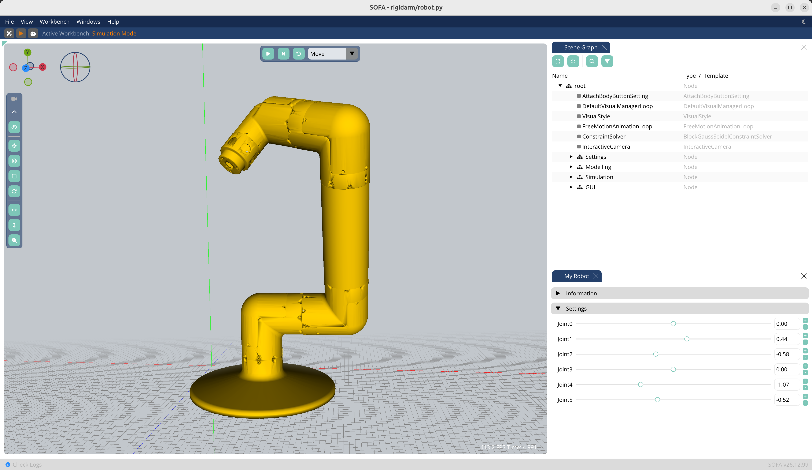

# Rigid Arm



## Requirements

### SOFA with plugins

- SofaPython3: 
    `git clone git@github.com:sofa-framework/SofaPython3.git`
- SoftRobots: 
    `git clone git@github.com:SofaDefrost/SoftRobots.git`
- SoftRobots.Inverse: 
    `git clone git@github.com:SofaDefrost/SoftRobots.Inverse.git`
- SofaGLFW: 
    `git clone git@github.com:SofaComplianceRobotics/SofaGLFW.git`
- [Optional] RigidBodyDynamics: for using Pinocchio to model the robot
    `git clone git@github.com:sofa-framework/RigidBodyDynamics.git`

## Installation 

1. Compile SOFA from source following the instructions from the SOFA website: https://www.sofa-framework.org/download/
2. Clone the plugins into common directory e.g. `plugins`:
    ```
    |-- SOFA
      |-- plugins
      |   |-- SofaGLFW
      |   |-- SoftRobots
      |   |-- SoftRobots.Inverse
      |   |-- SofaPython3
      |   |-- RigidBodyDynamics
      |   |-- CMakeLists.txt
      |-- build
      |-- src
    ```
3. Add the plugins to the SOFA project by editing the `CMakeLists.txt` file in the `plugins` directory:
    ```cmake
    cmake_minimum_required(VERSION 3.10)
    sofa_add_subdirectory(plugin SofaPython3 SofaPython3 ON)
    sofa_add_subdirectory(plugin STLIB STLIB ON)
    sofa_add_subdirectory(plugin SoftRobots SoftRobots ON)
    sofa_add_subdirectory(plugin SoftRobots.Inverse SoftRobots.Inverse ON)
    sofa_add_subdirectory(plugin SofaGLFW SofaGLFW ON)
    ```
4. Add to Cmake the path to the CMakeLists.tkt file by adding the following variable: `SOFA_EXTERNAL_DIRECTORIES=PATH_TO_/plugins` 
5. Now that the plugins have been added you can recompile the project.
    
### [Optional] Pinocchio to model the rigid robot

Install pinocchio:
    1. Follow installation procedure from: https://stack-of-tasks.github.io/pinocchio/download.html
    2. In CMake: `CMAKE_PREFIX_PATH = /opt/openrobots/lib/cmake/`

## Environment variables

You need to add the following environment variables to your system:

```
export SOFA_ROOT=PATH_TO_/build
export PATH=$SOFA_ROOT/bin:$PATH
export PYTHONPATH=$SOFA_ROOT/lib/python3/site-packages:$PYTHONPATH
```

## How to

Run the simulation:

```
runSofa -l SofaPython3,SofaImGui -g imgui scene.py
```
